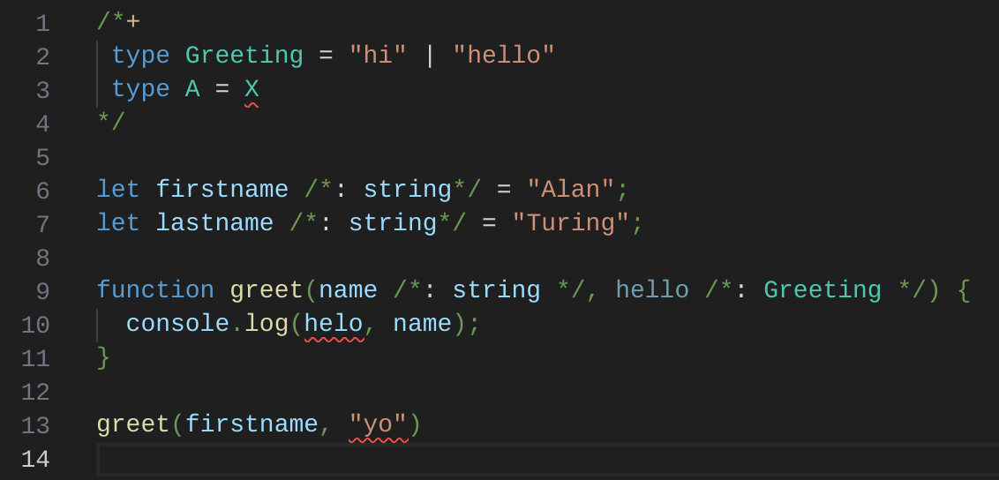

# Credt - A web framework experiment

An unconventional, small+fast web framework that uses a CRDT to sync server and client.

Thank you to each innovator who has gone before. You are a credit to us all.

### Goals:

- minimal compilation steps
  - use plain es2022 javascript on both client & server
  - type safety via ts-dot-js (javascript with typescript in comments)
- no API--state sync takes care of variables
- extremely fast load time and render time (SSR, small deps)
- server is just another peer
- peers can selectively trust signature-validated messages
- stretch goal: multiplayer

### Non-goals:

- backwards compat with non-modern browsers
- similarity to React development

## Questions

1. Can we get good type checking without a compile step? [It's looking promising](https://vmst.io/@canadaduane/110601683275741791).
2. Can we have fast web development without vite, and even faster SSR without bundling?
3. Can we sync state between server and client without spending so much time on API plumbing?

## Building Blocks

### Client

CRDT Library (see below for ongoing research)

[Sinuous](https://sinuous.netlify.app/)

- fast, efficient, tiny reactive UI library
- supports es modules, hydration
- size: 5kb / 2.9kb brotli

### Server

[uWebSockets.js](https://github.com/uNetworking/uWebSockets.js/)

- ~150k req/s nodejs server
- supports both HTTP and WS
- easily serves static files
  via [uwebsocket-serve](https://github.com/kolodziejczak-sz/uwebsocket-serve)

[jspm-cli](https://github.com/jspm/jspm-cli)

- installs packages for importmap

[Chomp](https://github.com/guybedford/chomp)

- fast, rust-based "make" system for javascript

[Linkedom](https://github.com/WebReflection/linkedom)

- A fast, reasonable server-side DOM

## Features

### Server-Side Rendering (SSR)

A `credt` web page is a `[file].html.ts.js` file. It runs on both the client and the server. It has 2 ways that it can run on the server:

1. If you run it via nodejs (e.g. `node index.html.ts.js > index.html`), it will print an HTML file to stdout that can be loaded in the browser. This HTML file is suitable for development mode--once created, you don't need to create it again. As you develop your `[file].html.ts.js` javascript and its dependencies, you can just reload the HTML page in the browser and it will include your new javascript code automatically.

2. If you add `NODE_ENV=production` to the environment, your `[file].html.ts.js` file will print an HTML file to stdout that includes a snapshot of the initial app state (HTML) for SSR (e.g. `NODE_ENV=production node index.html.ts.js > index.html`). When a user loads this production file, they won't see a blank page flash. In addition, the javascript will be loaded into the browser and hydrate the app and continue where the raw HTML left off, making it an SPA if desired.

All `credt` javascript code must be contained within isomorphic ES modules (i.e. the modules can run in node 18.0+ or the browser). NPM modules can be installed like usual via, e.g. `pnpm` for the server side. You maintain an `importmap` of modules and their online sources for the browser-side using the `jspm` CLI.

### ts-dot-js

`credt` provides a VS Code extension called [ts-dot-js](https://github.com/canadaduane/credt/tree/main/packages/ts-dot-js/vscode-extension) for ".ts.js" files. There is no build step for these files (they're just javascript, augmented with type annotations!)

Think of it as JSDoc annotations, but easier to learn if you already know typescript--and with the full power of typescript, rather than just the subset supported by JSDoc.

## Research

- jsdelivr seems to offer best CDN for js--fast, and brotli compressed
- animejs 6.5kb
- bsonfy 2.7kb - serialize/deserialize json-like objects in binary format over the wire

### CRDTs

| Name         | Size  | Reliability | Work | Description                                          |
| ------------ | ----- | ----------- | ---- | ---------------------------------------------------- |
| Yjs          | 37kb  | 10          | 3    | An excellent, reliable CRDT in javascript, but large |
| Automerge 2  |       |             |      | Requires wasm, which adds latency at load time       |
| mute-structs | 14kb  |             |      | Probably too large                                   |
| Antimatter   | 7kb   | 2           | 7    | Experimental but very promising CRDT with deletions. |
| causal-trees | 122kb |             |      | Too big                                              |
| js-crdt      | 3kb   | 4           | 5    | Old, but worth investigating due to tiny size        |

See [notepad-app](https://github.com/widmogrod/notepad-app/tree/master/src) for example app using js-crdt.

### CSS

- [css-in-js notes](https://github.com/nikitavoloboev/knowledge/blob/7c4bbc755c64368a82ca22b76566e9153cd2e377/docs/front-end/css/css-in-js.md)
- [emotion](https://github.com/emotion-js/emotion)
- [vanilla-extract](https://vanilla-extract.style/)
  - [css-to-vanilla-extract](https://css-to-vanilla-extract.netlify.app/)
- [reshadow](https://reshadow.dev/)
  - [codesandbox example with htm](https://codesandbox.io/s/reshadowhtm-x1ves?file=/src/html.js)
- [jss](https://cssinjs.org)
- [goober](https://github.com/cristianbote/goober) ~1kb
- [cxs](https://github.com/cxs-css/cxs) 612B

### Web Components

https://kinsta.com/blog/web-components/

### Tools

[Bundlephobia](https://bundlephobia.com) - NPM Package Sizes
- e.g. [sinuous](https://bundlephobia.com/package/sinuous@0.32.1)
